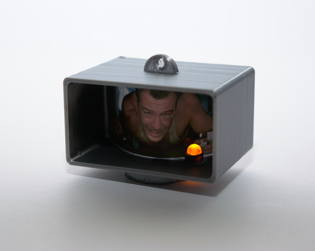
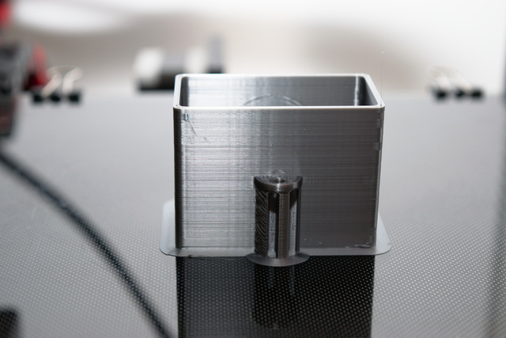
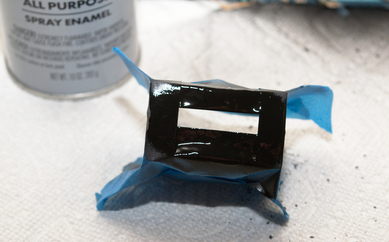
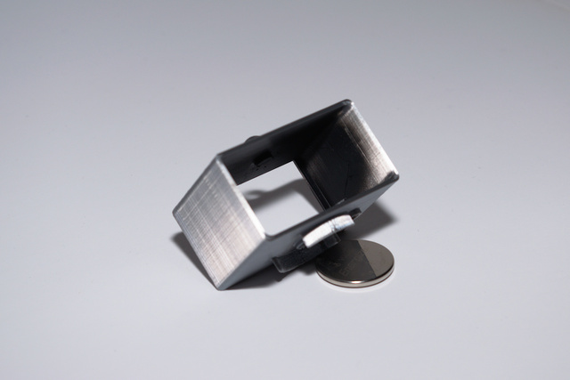
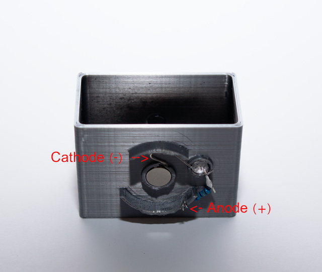

3D Printable Die Hard Ornament
===

Summary
---  

Adorn you tree with an illuminated tribute to the greatest Christmas movie of all time. 

|  |  |
| --- | --- |

Also Published
---

* [Thingiverse](https://www.thingiverse.com/thing:3953280)
* [Cults3D](https://cults3d.com/en/3d-model/home/die-hard-christmas-ornament)
* [htxt](https://www.htxt.co.za/2019/11/15/3d-printed-die-hard-ornament-is-the-perfect-christmas-tree-addition/)

Supplies
---

[Flame Flicker LED](http://addlink)  
[Coin Style Battery](http//addlink)  
[Magnets](http://addlink)

Material
---
| Setting | Value |
| --- | --- | 
| Material | PLA | 
| Color | Silver | 

Print Setting
---
| Setting | Value | 
| --- | --- |
| Layer Height | 0.2mm |
| Supports | Everywhere |

Post Printing
---

### Support Removal and Part Fitment

Remove the supports and ensure all parts will fit in their respective places.

### Paint (optional)

A slight front to rear fade to black will help with the illusion. If you don't have an airbrush you can make a small window from tape and get a similar effect. 

|  |  |
| :---: | :---: |
| *paint window* | *fade to black* |

### Assemble 

1. Set the magnet in place, use glue if needed or desired
2. (Optional) solder a resistor to the LED if needed or desired *Be sure to add this resistor the anode or it will interfere with the battery making contact.*
3. Push the LED into place being sure to keep the anode to the outside of the ornament, loop this around the the hole several times as shown. 
4. Make a small loop in the negative side of the led so that it will contact the magnet wen inserted. 
5. Insert the battery, negative side toward magnet, the positive side should contact the lead looped around the hole. 
6. Ho Ho Ho, now you have an ornament

Notes
---

The stl included is designed around the 2430 battery but this can be changed easily via the variables in the config section of the scad file

The notations on the bottom of the insert picture were to help me determine which of the variants I liked best when I printed them out at CVS. I have no idea what they stand for anymore but this was the one I used and saved.
